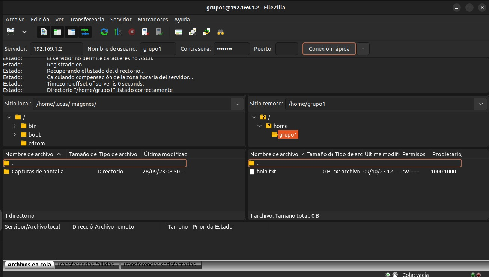

# Índice 
1. [Introducción](#introducción)
2. [Instalación del servidor ftp](#instalación-del-servidor-ftp)
3. [Configuración](#configuración)
4. [Conexión al servicio](#conexión-al-servicio)
5. [Conclusión](#conclusión)

# Introducción

Nosotros somos el grupo 1, conformado por: Ferreyra Octavio -Galleguillo Lucas - Hlavach Joaquin - Lucero Octavio - Hermes Puig. En este apartado veremos la instalación de un servidor FTP básico (vsftpd). Luego configurarlo para que la Raspberry sea el servidor de la red LAN de nuestra mesa. Donde probaremos la accesibilidad al servicio utilzando como cliente ftp la aplicación "Filezilla".
## Instalación del servidor ftp

En el primer paso, prenderemos y conectaremos la raspberry. Antes de comenzar con la instalación de dicho servidor, es necesario actualizar el listado de paquetes mediante el comando:

```bash
sudo apt update
sudo apt upgrade
```
Luego una vez ya inciada, para instalar el servidor ftp, deberemos usar el siguiente comando:

```bash
sudo apt install vsftpd
```

Al utilizar el comando "sudo" usara los permisos del superuser, seguido de un apt el cual es el gestor de paquetes predeterminado de Ubuntu y por ultimo el install acompañado del nombre del paquete que hace referencia al servidor FTP.

## Configuración
Primero que todo hay que editar el archivo etc/vsftpd.conf e modificando los siguientes parámetros:

```bash
local_enable=YES
write_enable=YES
```
En este paso, lo que hacemos es permitir la escritura de los archivos a los usuarios de la Raspberry Pi, descomentando estas dos líneas de codigo.

Luego tendremos que reiniciar el servicio:

```
sudo service vsftpd restart
```
## Conexión al servicio

Una vez que hemos instalado nuestro servidor FTP, vamos a ver si funciona, para ello, descargamos [Filezilla](https://filezilla-project.org/) que es un cliente FTP. Al abrirlo nos aparecerá una ventana tal como esta:



Tendremos que conectarnos al servidor FTP ingresando la IP de la Raspberry, (que en nuestro caso es 192.168.1.2). También ingresaremos el usuario y la contraseña de nuestra Raspberry.
## Conclusión

En esta cuarta entrega, pudimos cumplir nuestro objetivo exitosamente, conociendo principalmente lo que es un Servidor FTP, que significa “File Transfer Protocol”, Protocolo para la Transferencia de Archivos. Donde la función del mismo es permitir el desplazamiento de datos entre diferentes servidores / ordenadores. Es decir que un cliente puede subir archivos al servidor para que otros puedan acceder a él.
Por lo tanto, instalamos el servidor FTP, para posteriormente configurarlo para que la Raspberry sea el servidor de la red LAN de nuestra mesa, probando así la accesibilidad al servicio utilizando como cliente ftp la aplicación "Filezilla".